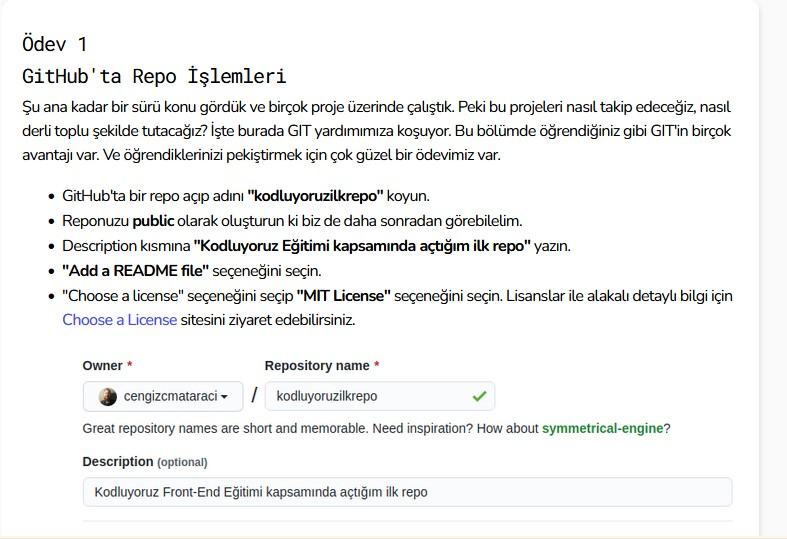

# kodluyoruzilkrepo
Kodluyoruz Eğitimi kapsamında açtığım ilk repo



## Installation 

Öncelikle projeyi klonlayın.

```
git clone https://github.com/sunay-d/kodluyoruzilkrepo.git
```

## Usage

Projeyi klonladıktan sonra VS Code programında açınız.

Linux için

```
cd kodluyoruzilkrepo
code .
```
